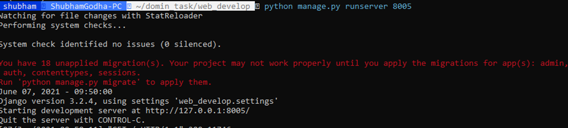
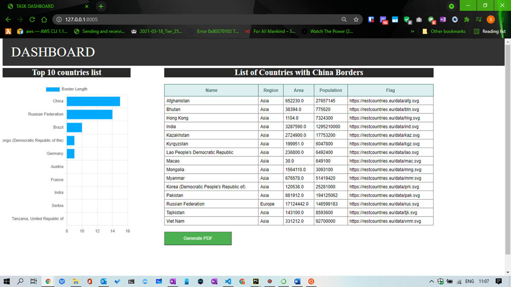
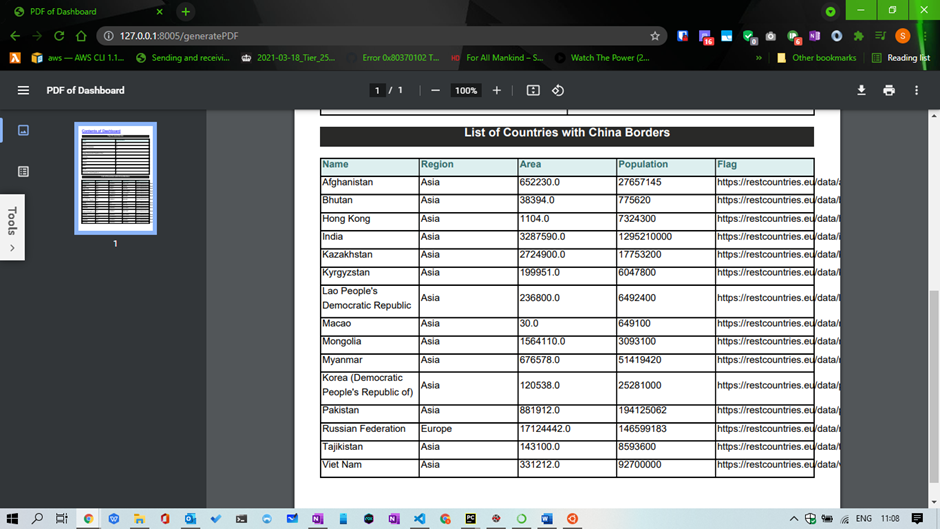

# Domin_task User Manual
## Task1

**Develop a Simple Web Application with the following features:**

Create a simple dashboard(web page) with following content:

* Bar Chart 

* Table

* Pdf Generator 

# Solution/Steps
For running this application User need to following steps.

**Step1:** Download the latest version of python, for this i am using python 3.8.

**Step2:** Open Command Prompt or Favourite IDE.

**Step3:** Create Virtual Environment for the python project.

"sudo pip3 install virtualevn"

**Step4:** Create new directory and open this directory.

"mkdir task"

"cd newtask"

**Step5:**  Now, Create a virtual environment in the project directory 

"virtualevn newenv"

**Step6:** To install all packages or dependency into this environment, virtual environment 
must be activated. 

"source newenv/bin/activate"

**Step7:** Now install all dependency for the application

* **For django** "pip3 install django"
* **For pandas** "pip3 install pandas"
* **For numpy**  "pip3 install numpy"
* **For PDF Generator** "pip3 install xhtml2pdf"

**Step8:** Now all set to add code in the Directory. So, clone the code from Github.

"git clone https://github.com/jain221/domin_task.git"

**Step9:** Then using cd in the project folder go to web_develop directory 

"cd domin_task/ web_develop"

**Step10:** Final step to execute application using following command

"python manage.py runserver 8000"

Then Server will start and provide url.

**eg.** "http://127.0.0.1:8000"
Copy this URL and past in this browser.
Then Task dashboard will be display with above task.

**Step11:** Generate pdf of the dashboard content

To get pdf User need to click on the **Generate PDF** button then new window will oben
with pdf file.
User can download this file or can take print out.

